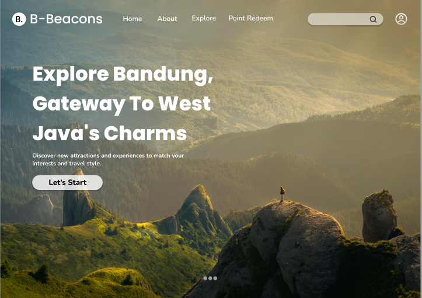

# B-beacon react+vite

ini merupakan website untuk mengexplore wisata yang ada di bandung dengan cara yg menarik

## Screenshots



## Run Locally

Clone the project

```bash
  git clone https://github.com/melindaoktaviani/b-beacon.git
```

Go to the project directory

```bash
  cd b-beacon
```

Install dependencies

```bash
  npm install
```

Start the server

```bash
  npm run dev
```

## Demo

http://localhost:5173/
